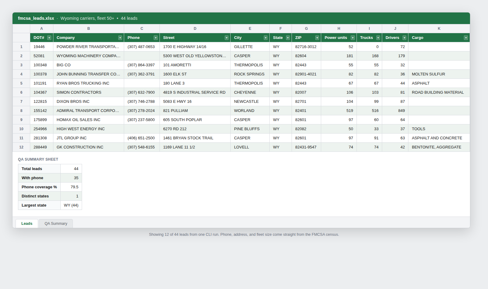

# FMCSA Lead Scraper

Build a filtered sales-lead list of US trucking carriers from the public FMCSA
motor carrier census, and export it to Excel ready for a sales team.

Filter by state, fleet size, and active status. The tool pulls the matching
carriers, deduplicates them, normalizes phone numbers, and writes an `.xlsx`
workbook with a Leads sheet and a QA summary.

## Data source

Public data from the Federal Motor Carrier Safety Administration, served through
the Socrata API on data.transportation.gov (dataset `az4n-8mr2`). This is US
government open data, so there is no login and no terms-of-service grey area.

No API key is needed for the row volumes this tool pulls. If you have a free
Socrata app token and want higher rate limits, set it in `SOCRATA_APP_TOKEN`.

## Install

```bash
python3 -m venv venv
venv/bin/pip install -r requirements.txt
```

## Usage

```bash
# Active carriers in Texas with at least 10 trucks, written to texas_leads.xlsx
venv/bin/python -m fmcsa_leads.cli --state TX --min-power-units 10 --output texas_leads.xlsx

# Several states at once, every active carrier
venv/bin/python -m fmcsa_leads.cli --state TX,CA,FL --output southwest_leads.xlsx

# With best-effort email enrichment on the first 25 carriers
venv/bin/python -m fmcsa_leads.cli --state WY --min-power-units 50 --enrich-email --output wyoming_leads.xlsx
```

| Flag | Meaning |
|---|---|
| `--state` | Comma-separated 2-letter state codes, e.g. `TX` or `TX,CA,FL` |
| `--min-power-units` | Keep only carriers with at least this many power units |
| `--include-inactive` | Include carriers not marked active in the census |
| `--all-states` | Pull the entire national census when no `--state` is given (millions of rows) |
| `--enrich-email` | Find each carrier's website and scrape a contact email (slow, best-effort) |
| `--enrich-limit` | Cap how many carriers to enrich (default 25) |
| `--enrich-delay` | Seconds between enrichment requests (default 1.0) |
| `--output` | Output `.xlsx` path (default `fmcsa_leads.xlsx`) |

State codes are checked against the codes that occur in the census: the 50 US
states, DC, US territories, and Canadian provinces (FMCSA registers cross-border
carriers). An unrecognized code like `CZ` is rejected with a clear message rather
than silently returning nothing. Running without `--state` pulls the whole country
and is gated behind `--all-states` so it cannot happen by accident.

## Output

The workbook has two sheets:

- **Leads** — DOT number, company, phone, address, state, fleet size, drivers, cargo.
- **QA Summary** — total leads, phone coverage, distinct states. A quick sanity check before the list goes to a sales team.

A sample run for large Wyoming carriers is in `samples/wy_large_carriers.xlsx`:



## Phone, and optional email

The census carries phone numbers but not email addresses. For trucking outreach
the phone is the primary channel, so the lead list is built phone-first.

`--enrich-email` adds two columns (Website, Email) by searching for each carrier's
website and scraping a contact address from it. This is best-effort: coverage is
partial because many small carriers have no website, and a free search engine
rate-limits after a few requests. Only a site whose domain matches the company
name is trusted, so a result is never an industry directory's address. For high
volume, point the website-discovery step at a keyed search API.

Fleet-size filtering happens in Python, not in the API query, because the census
stores unit counts as text. State and active-status filtering happen server-side.

## Limitations and next steps

Email enrichment depends on a free DuckDuckGo search to find each carrier's
website. DuckDuckGo starts returning HTTP 202 throttle responses after roughly
15 queries, so on a large run most website lookups come back empty. The code
isolates that lookup in `find_carrier_website`, so swapping in a keyed search
API (Brave Search, SerpAPI, or Bing) raises the volume ceiling without changing
the rest of the pipeline.

Planned next: a cargo-type filter, a CSV output option next to the Excel file,
and a resume flag so an interrupted enrichment run continues instead of starting
over.

## Tests

```bash
pip install -r requirements-dev.txt
PYTHONPATH=. python -m pytest tests -q
```

The tests cover phone normalization, DOT-number deduplication, fleet-size
filtering, state-code validation, the query-builder, the website-matching guard
used in email enrichment, and the styled Excel output (header fill, frozen pane,
row banding). None of them touch the network.

---

Built by Adam Kramarczyk. More scrapers, data tools and live demos at [helban.dev](https://helban.dev).
